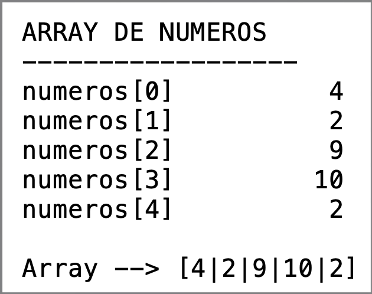
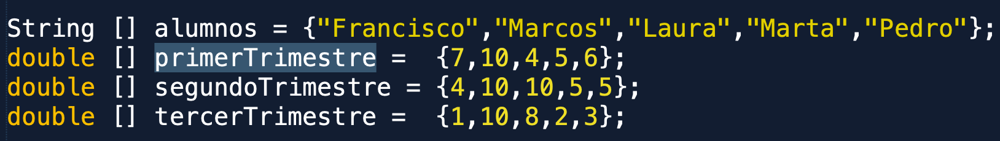
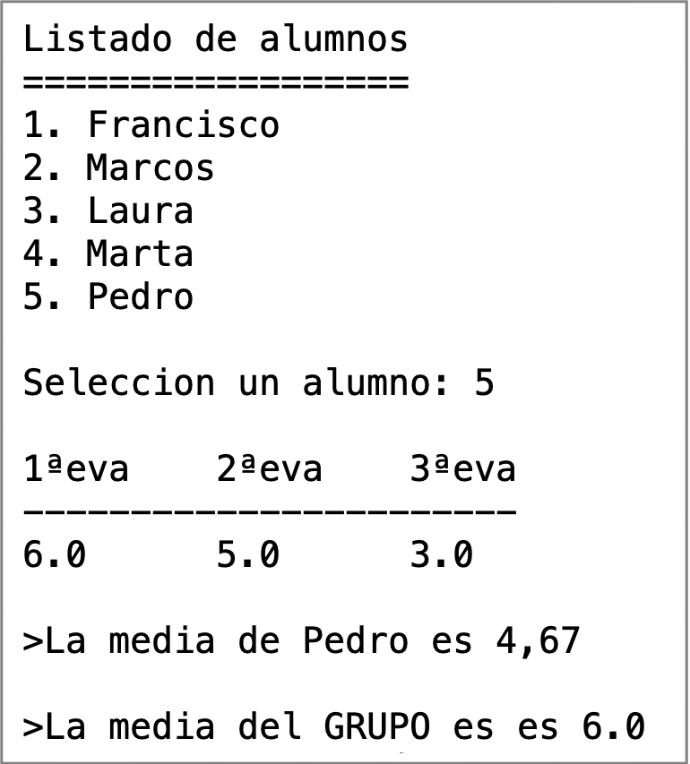
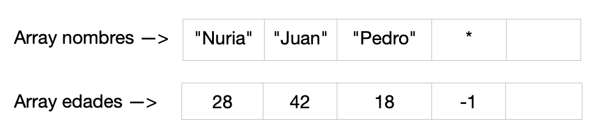
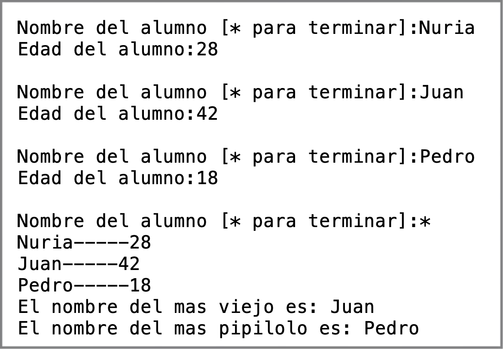
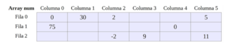
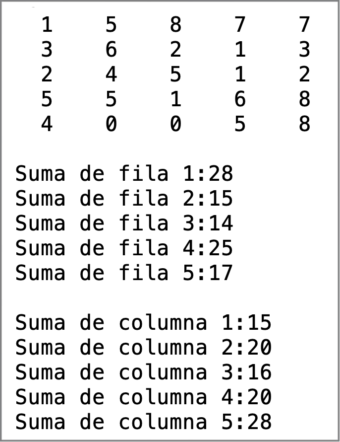
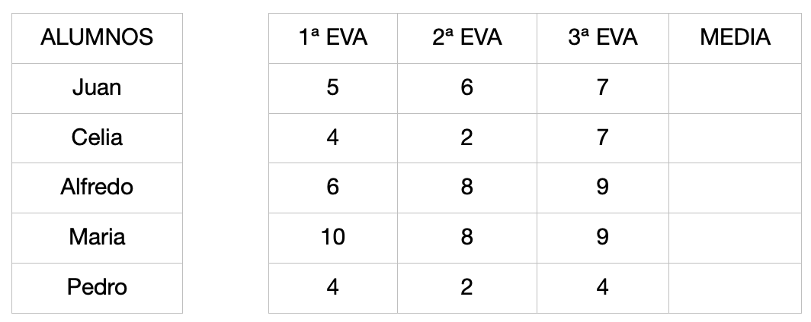
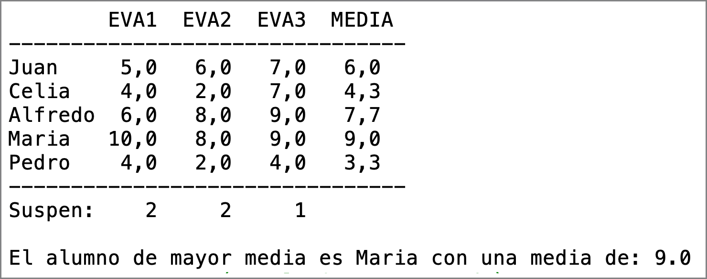

# Tema 2 - Ejercicios de arrays

## Ejercicio01 - tabla multiplicar

PARTE1
Declara el siguiente array de String de dos maneras:
- en la misma línea y directamente
- declarar el array y luego rellenarlo.

|perro|gato|rata|pajaro|raton|
|-----|----|----|------|-----|


Mostrar los valores:
- Escribiendo cinco System.out.println
- Usando un bucle for

PARTE2  
Define un array de enteros. Los valores en tiempo de compilación serán 2,4,6,8,10.
Muestra los valores en orden inverso usando un for y usando la propiedad `.length` del array.


## Ejercicio02 - meter numeros en array
Lee por teclado 5 enteros y mételos en un array llamado _numeros_.

A continuación muestra todos los números de la forma que muestro a continuación. Usa un for para recorrer el array y mostrarlos de las dos formas (ver imagen):
- forma 1: usar printf, columna de ancho 10.
- forma 2: en una línea (hazlo exactamente como la imagen).




## Ejercicio03 - leer notas
Se quiere realizar un programa que lea por teclado las 5 notas obtenidas por un alumno (comprendidas entre 0 y 10). A continuación debe mostrar la nota máxima, la mínima y la   media.

## Ejercicio04 - rellenar array 
Programa que declare un array de diez elementos enteros y pida números para rellenarlo hasta que se llene el array o se introduzca un número negativo. Este negativo será el último valor metido en el array. A continuación, imprimiremos el vector,  pero solo los positivos. 


## Ejercicio05 - son pares todos?
Dada una lista de 5 números en código, indicar si todos ellos son pares.

## Ejercicio06 - comparar lista
Definir dos arrays de enteros en código y decir si son iguales o distintos. El orden tiene que ser el mismo

Ejemplo:  
1 - 2 - 3 - 2    VS    1 - 9 - 5 - 2      ❌  
1 - 2 - 3 - 2    VS    1 - 2 - 3 - 2  	  ✅


## Ejercicio07 - comparar lista con array auxiliar
Definir dos arrays de enteros en código y decir si son iguales o distintos. Los valores tienen que estar entre 0 y 9 y ambos arrays serán del mismo tamaño. Usar una tabla auxiliar para llevar el conteo de los números que están el el array. 
1 - 2 - 3 - 5    VS    1 - 9 - 5 - 2      ❌   
1 - 5 - 1 - 2    VS    2 - 1 - 5 - 1  	  ✅   


## Ejercicio08 - crece/decrece/iguales
PARTE1 (la hacemos para entender el problema y cómo resolverlo): dada  una lista de números en código, indicar si están en orden creciente.

PARTE2: dada una lista de números en código, indicar si están en orden creciente, decreciente o sin ordenar.


## Ejercicio 09 - split
- Introducir una frase por teclado (con sus espacios en blanco) y contar el número de palabras que tiene y mostrar cada una de las palabras.
- Introducir una fecha por teclado en formato dd/mm/aaaa y obtener separadamente el dia, el mes y el año.
Usar para realizar el ejercicio la función split de una variable tipo String. Suponemos que frase es una variable de tipo String.

`String[] palabras=frase.split(" ")`

La función split anterior separa la frase buscando espacios en blanco y guarda las palabras en un array.


## Ejercicio10 - fecha correcta con array de dias
Hacer un programa que nos pida una fecha en formato dd/mm/aaaa y muestre por pantalla la fecha en formato indicado habiendo comprobado si es correcta o no. OPCIONAL: para chequear los años bisiestos, usar la función vista anteriormente.

Para chequear los días de cada mes y mostrar el nombre de los meses, define en tiempo de compilación dos arrays:
```
int[ ] diasMes={0, 31, 28, ……..}        //el primer elementos no lo usamos
String[ ] nombreMeses={"","enero","febrero",…….}
```

```
Entrada: 21/05/2000
El <21 de mayo de 2000> es una fecha CORRECTA

Entrada: 31/06/2000
La fecha es INCORRECTA. Día incorrecto
```

## Ejercicio11 - split2
Define en código la siguiente cadena:

```
String linea="alicia;peralta;manduca;alicia.peralta@gmail.com;600554433"
```

Sabiendo que el orden de campos siempre va a ser el mismo (nombre;apellido1;apellido2;email;telefono), usando la función _split_, obtén los siguientes elementos:

- Nombre completo (es necesario guardarlo en una variable, no solo mostrarlo).
- Nombre de usuario del email (también necesario guardarlo en una variable)
- Teléfono (idem a los anteriores).


## Ejercicio12 - notas y medias de una clase
Hacer una program que muestra las notas y medias de una clase de 5 alumnos. Para agilizar, las notas de los alumnos estarán metidas en tiempo de compilación y serán las siguientes:



Pedir por teclado un alumno, y mostrar su media y la media del grupo. 



## Ejercicio13 - nombres y edades de alumnos
Queremos guardar los nombres y la edades de los alumnos de un curso. Realiza un programa que introduzca el nombre y la edad de cada alumno. El proceso de lectura de datos terminará cuando se introduzca como nombre un asterisco (*) o cuando introduzcas el máximo de alumnos (como tamaño de array, usar 5).
Si terminamos con *, meteremos dicho * en la ultima posición del array de alumnos y un -1 en la ultima posición del array de edades.



Al finalizar se mostrará los siguientes datos:
- Nombre del alumno de mayor edad
- Nombre del alumno de menor edad




## Ejercicio14 - buscar la moda
Usando bucles anidados, calcula la moda del siguiente array dado de 5 elementos. La moda de una secuencia de números es el elemento que se repite un mayor número de veces. Haz el ejercicio permitiendo que haya solo una moda. y OPCIONALMENTE, permitiendo que haya más de una moda.


| 5 | 4 | 5 | 2 | 5 |
|---|---|---|---|---|

La moda en el caso anterior es 5


---

# ARRAYS BIDIMENSIONALES 

## Ejercicio15
Define un array bidimiensional de números enteros de 3 filas por 6 columnas con nombre num y asigna los valores según la siguiente tabla. Muestra el contenido de todos los elementos dispuestos en forma de tabla como se muestra en la figura.
Asigna los  valores en tiempo de compilación, usando la notación num[ ][ ]




## Ejercicio16
Crea una tabla bidimensional de longitud 5x5 y nombre ‘matriz’. Rellena la tabla con valores enteros aleatorios entre 0 y 9 `(int)(Math.random()*10)`

Muestra la tabla por pantalla.  

Suma todos los elementos de cada fila y todos los elementos de cada columna visualizando los resultados en pantalla.



## Ejercicio17
Se tiene la siguiente tabla notas con las notas y la media de las tres evaluaciones de 5 alumnos y un array alumnos con los nombres de los alumnos.



Se pide calcular los siguientes datos:
- Añadir a la tabla la media de las tres evaluaciones de cada alumno usando un bucle anidado (no usando 5 bucles). Imprimir por pantalla las notas
- Rellenar un array con los suspensos de cada evaluación. Imprimirlo por pantalla.
- Indicar el nombre del alumno con mayor media, indicando la media.



