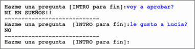
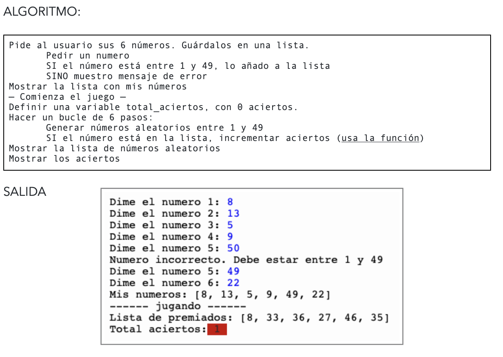

# Tema 2 - Ejercicios de ampliación2

## Amplia1 - busca animales
Definir en código el siguiente arrray de 10 elementos String:  

|perro|gato|rata|pajaro|raton|
|-----|----|----|------|-----|


1. Pedir por teclado una letra y mostrar los animales cuyo nombre empieza por dicha letra.
2. Hacer una función a la que le pases el array de animales, una letra, y te devuelva la lista de animales que empiezan por dicha letra.

```text
Dime una letra: p
    Animales que empiezan por 'p': perro, pajaro

Dime una letra: z
    No hay animales que empiezan por 'z'
``` 

## Amplia2 - comparar dos listas con bucle anidado
Definir dos arrays de enteros en código del mismo tamaño y decir si son iguales o distintos. El orden puede ser distinto. No se pueden repetir los números. Hacerlo con un bucle anidado.  
1 - 2 - 3 - 5    VS    1 - 9 - 5 - 2      ❌  
1 - 5 - 3 - 4    VS    5 - 1 - 4 - 3  	  ✅  

OPCIONAL: permitir repeticiones


## Amplia3 - bola mágica
Simula el juego de la bola mágica que responde a tus preguntas. El programa te pedirá que formules una pregunta y te responderá a la misma. En realidad, hay una serie de respuestas predefinidas en una lista.  

```text
respuestas=["SI", "NO, "PUEDE", "NI EN SUEÑOS!!", "SEGURO!!!"]
```

Para una pregunta, generaremos un número aleatorio para acceder a cada uno de los valores y mostrar la respuesta. Por ejemplo, si se genera el número aleatorio 3, al acceder a respuestas[3], nos responderá "NI EN SUEÑOS".




## Amplia4 - Bonoloto
Simula el juego de azar de la bonoloto adaptada. El jugador elige 6 números diferentes entre el 1 y el 49.

Como ayuda, define una función para comprobar si un numero del sorteo es un acierto o no.




## Amplia5 - Estudio bonoloto
Sobrel el ejercicio de la bonoloto, quiero generar estadísticas. Lanzar en bucle 1000 simulaciones y en una tabla, guardar el número de aciertos de cada simulación, para posteriormente mostrar las estadísticas, indicando la cantidad de aciertos de 6 numeros, de 5, de 4, etc.


## Amplia6 - buscar la moda (posibilidad de más de una moda)
Usando bucles anidados, calcula la moda del siguiente array dado de 10 elementos. La moda de una secuencia de números es el elemento que se repite un mayor número de veces. Haz el ejercicio permitiendo que haya más de una moda.


| 5 | 4 | 5 | 2 | 5 | 9 | 1 | 9 | 3 | 9 |
|---|---|---|---|---|---|---|---|---|---|

La moda en el caso anterior es 5 y 9


## Amplia7 - adivina numero con ranking en fichero
Realizar un juego para adivinar un número entre 1 y 50. Para ello, definir en una variable el número N a adivinar. Luego ir pidiendo números indicando “mayor” o “menor” según sea mayor o menor con respecto a N. El proceso termina cuando el usuario acierta.
Para hacerlo más entretenido, el número N podemos hacerlo aleatorio con el siguiente código:  
`int N=(int)(Math.random()*50)+1`
MEJORA: indíca al final cuantos intentos has necesitado para adivinar.
SUPERMEJORA: guarda en un fichero el record de intentos. Si el usuario lo supera, monta una fiesta.
