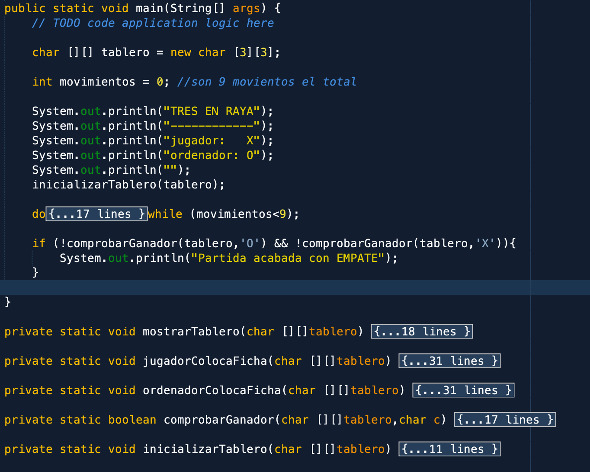
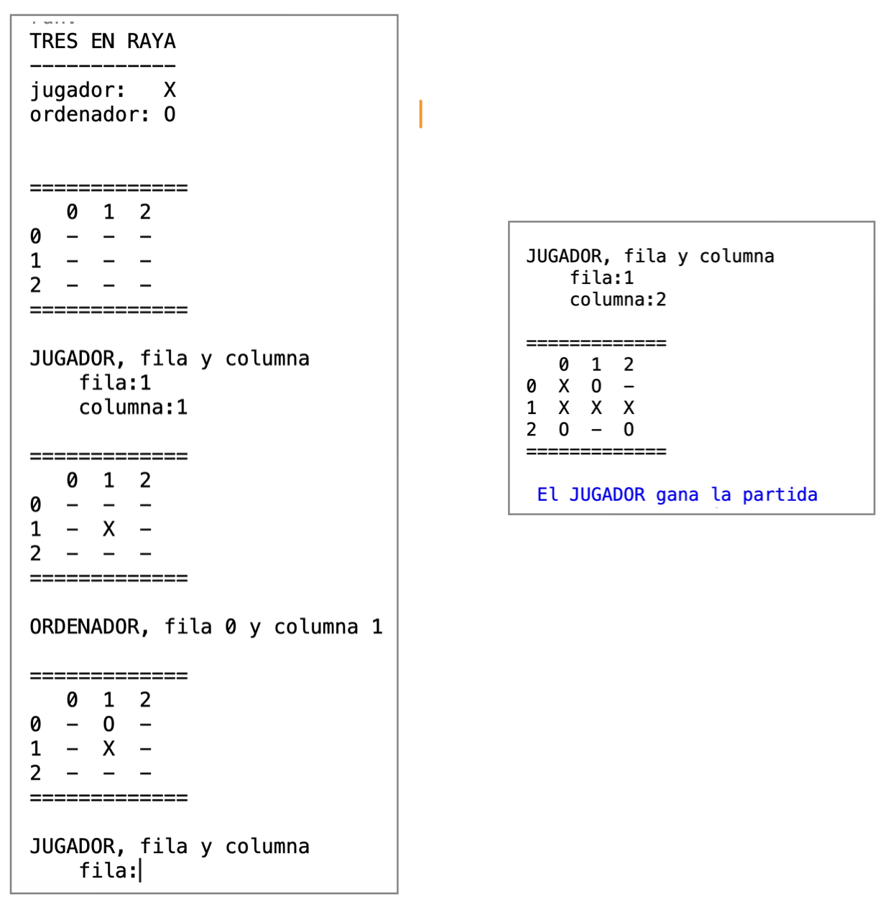

# JUEGOS CON PROGRAMACIÓN ESTRUCTURADA

## TRES EN RAYA

Programar el juego del tres en raya, para un usuario que juega contra la máquina.

- El tablero será una array bidimensional de 3 x 3, de tipo char.
- Podemos inicializar el tablero con guiones en las 9 casillas, así será más fácil pintarlo que dejando espacios en blanco
- El juego va por turnos: el jugador escoge una casilla (indicando fila y columna) y luego el ordenador de forma aleatoria escoge otra casilla. Así hasta que haya un ganador o se agoten los movimientos
- Os proporciono una main y una lista de funciones que yo he usado, pero en realidad, podéis hacerlo como querías, es para daros ideas.

NOTA: para comprobar un ganador, podeis hacer un if..elseif de los 8 casos posibles para ganar. Opcionalmente, se pueden usar bucles para ahorrar casos, pero puede que se tarde más en pensar como que haciendo los 8 casos.

---

## HUNDIR LA FLOTA

....MáS ADELANTE....o hazlo tu

