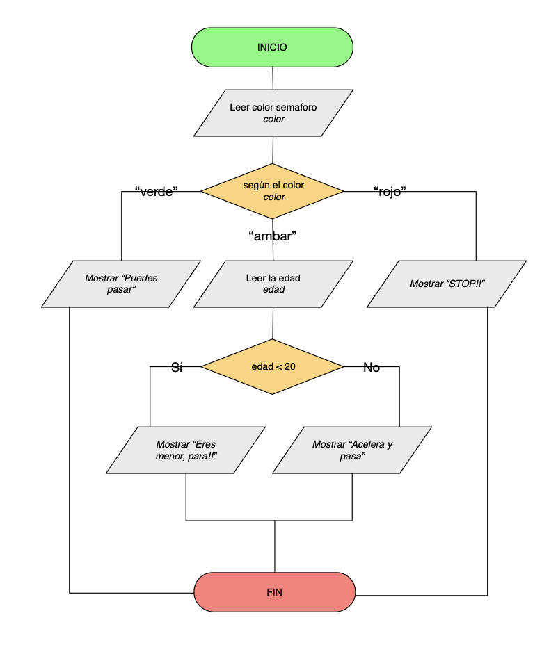
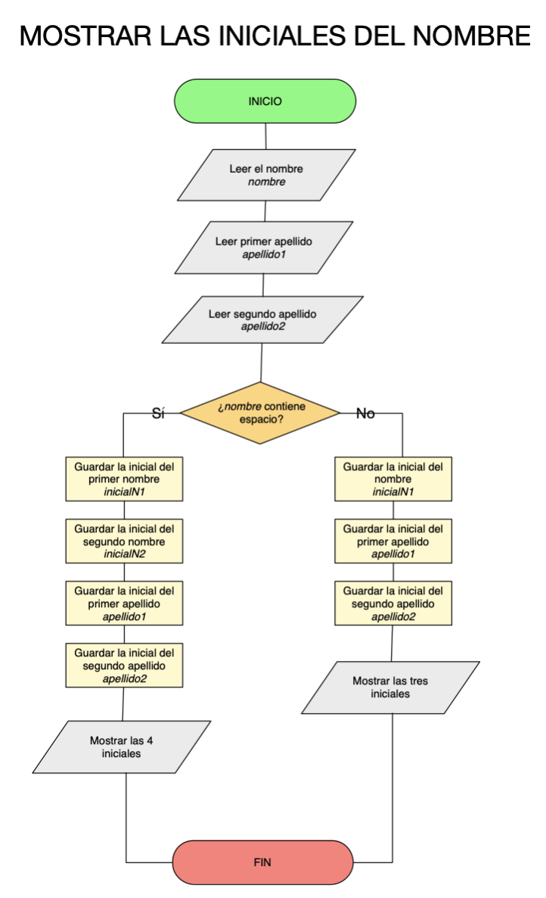
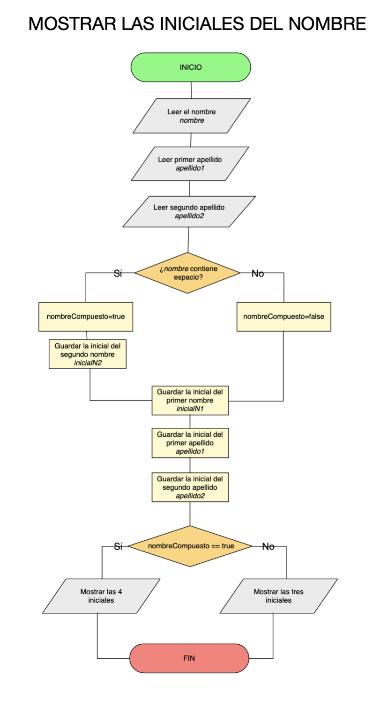

# Tema 2 - Ejercicios de estructura condicional (en JAVA)

## Ejercicio 1 - par/impar
Escribe un programa que lea un número e indique si es par o impar.
ALTERNATIVA: usa un booleano `espar`

## Ejercicio 2 - positivo/negativo/cero
Escribe un programa que te diga si un número entero es positivo, negativo o es cero. Hazlo usando tres if {…} y hazlo usando if {…} else

## Ejercicio 3 - login sencillo
Escribe un programa que pida un nombre de usuario y una contraseña y si se ha introducido “root” y “toor” se indica “Has entrado al sistema”, sino se da un error.
Hazlo de tres formas: usando una condición doble, usando un if..else anidado y usando booleanos.

## Ejercicio 4 - cálculo de nota final
Realiza un programa que te pida la nota de tres exámenes, examen1, examen2 y examen3 realizados en la evaluación. Las notas pueden tener decimales. Cada examen tendrá el peso de 30%, 30% y 40% respectivamente. Calcula la nota de la evaluación y muéstrala. Además de la nota, indica si es un SUSPENSO, SUFICIENTE, BIEN, NOTABLE, SOBRESALIENTE o MATRICULA DE HONOR. Esto último hazlo usando IF…ELSE IF….ELSE

MEJORA: comprueba además que la nota es válida, es decir, que no es <0 y no es >10.

## Ejercicio 5 - calculo nota final con trabajo
Modifica el ejercicio anterior. Además de las tres notas, comprobaremos si el alumno ha entregado el trabajo o no (hazlo preguntándolo por teclado, respondiendo S o N).
El caso de que no haya entregado el trabajo, la nota de la evaluación será un 4. En el caso de que sí haya entregado el trabajo, la nota de la evaluación será la calculada como en el ejercicio anterior.

MEJORA: comprueba además que la nota es válida, es decir, que no es <0 y no es >10. Hazlo con una condición doble de tipo OR   ||

## Ejercicio 6 - buenos dias/tardes/noches
Realiza un programa que te pida por teclado la hora del día (en formato 24H) y según la misma, te diga te de los "BUENOS DÍAS" (de 6 a 12), las "BUENAS TARDES" (de 12 a 21) o las "BUENAS NOCHES" de (21 a 6).

Por ejemplo:  
- Entrada →  hora=22;  
- Salida  →  "Son las 22. BUENAS NOCHES!!"

MEJORA: Investiga cómo se podría hacer para que tomara la hora actual y no tengamos que meterla.

## Ejercicio7 - bisiesto
Hacer un programa que le digas un año y te diga si es bisiesto. Un año es bisiesto:

Es divisible entre 4 y no es divisible entre 100.
Es divisible entre 100 y 400.

Ejemplos de años bisiestos: año 2000,año 2024, 2028

## Ejercicio 8 - SWITCH
Hacer un ejercicio usando la estructura de control SWITCH que te indique el nombre del día de la semana (LUNES, MARTES,…) dado el número de día introducido por teclado.

## Ejercicio 9 - SWITCH con case múltiple
Hacer un programa que pide introducir por teclado un número entero entre 1 y 7 correspondiente a un día de la semana y muestra un mensaje indicando si ese día hay clase de programación o no.
Usa un switch con case múltiple.

## Ejercicio 10 - semáforo - if dentro del case
Hacer un ejercicio que te indique el color del semáforo y según el mismo, te diga lo que tienes que hacer. Usar un SWITCH para hacerlo.
Contempla tres colores: "verde", "rojo", y "ambar". Usa el default para contemplar meter un color incorrecto.

MODIFICAICON: Si es color "ambar", según la edad hará una cosa u otra. Menor de 20 años debe parar y en caso contrario, puede pasar.

## Ejercicio 11 - fecha correcta
Escribe un programa que pida una fecha (día, mes y año se piden por separado) y diga si es correcta. El año puede ser cualquiera por encima del 1900 y por debajo del 2500. Ten en cuenta los años bisiestos.

## Ejercicio12 - calculadora
Realiza una calculadora simple. Primero se pedirá por teclado dos números. Una vez introducidos, se mostrará un menú con cinco opciones a realizar:
opción 1: sumar
opción 2: restar
opción 3: multiplicar
opción 4: dividir
opción 5: salir
Cuando escojas una opción, mostrará el resultado por pantalla.

## Ejercicio13 - iniciales
Haz un programa que dado el nombre y los apellidos, pudiendo ser el nombre simple o compuesto, te devuelva las iniciales del mismo.  
Para hacerlo más sencillo, recoge los datos de entrada en varias líneas. Pregunta primero por el nombre, luego por el apellido1 y luego por el apellido2.

**Funciones**
- Usa la función `cadena.indexOf(' ')` para obtener la posición del carácter espacio en blanco. Esta función devuelve el valor -1 en caso de que no encuentre dicho carácter.
- Usa la función `cadena.charAt(posicion)` para obtener el carácter que se encuentra en una posición concreta de una cadena. La primera posición es la cero.

MEJORA: las iniciales las debes mostrar en mayúsculas. Para convertir texto a mayúsculas hay muchas opciones:
- Usa la función `Character.toUpperCase(caracter)` para convertir un carácter a mayúsculas
- Usa la funcion `cadena.toUpperCase()` para pasar toda una cadena a mayúsculas.

