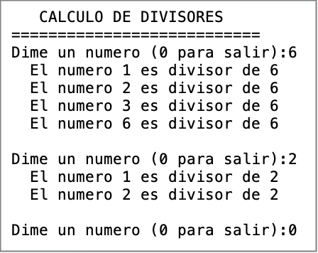

# Tema 2 - Ejercicios de bucles (en JAVA)

## Ejercicio 1 - tabla multiplicar
Realizar un algoritmo que muestre la tabla de multiplicar de un número introducido por teclado. Hacerlo primero con un bucle for, y luego, usar un while y do-while


## Ejercicio 2 - posi/nega/cero
Realizar un programa que pida números (se pedirá por teclado la cantidad de números a introducir). El programa debe informar de cuantos números introducidos son mayores que 0, menores que 0 e iguales a 0.


## Ejercicio 3 - bucles ascendente y descendente)
Imprime los números múltiplos de 5 que haya del número 0 al 50. Realiza el ejercicio con los tres tipos de bucles.
Mostrar los números del 100 al 50 en orden descendente que sean pares. Realizar el ejercicio con los tres tipos de bucles.


## Ejercicio 4 - menu 
Dado este miniminimini programa:
1. Hacer que si se mete una opción no válida, el usuario tenga que volver a meter la opción.
2. Hacer que el menú se repita hasta elegir la opción de salir.

MEJORA: Finalizada la opción, aparecerá "pulsar INTRO para continuar". Hazlo simplemente leyendo por teclado una tecla, pero no hagas nada con ella.

```text
        System.out.println("MENU");
        System.out.println("========");
        System.out.println("1. Decir hola");
        System.out.println("2. Decir adios");
        System.out.println("3. Salir");

       
        System.out.print("Dime una opcion:");
        int opcion = Integer.parseInt(teclado.nextLine());

        switch (opcion){
            case 1:
                System.out.println("Hola!");
                break;
            case 2:
                System.out.println("Adios");
                break;
        }
``` 


## Ejercicio 5 - vocales
Algoritmo que pida caracteres e imprima ‘VOCAL’ si son vocales y ‘NO VOCAL’ en caso contrario, el programa termina cuando se introduce un espacio.

## Ejercicio 6 - Testigo. If sin else
Hacer un programa que lea números enteros por teclado (uno a uno). El programa termina al introducir un cero.  
Al finalizar, indicar si hemos introducido algún número negativo y decirlo.


## Ejercicio 7 - Uso de acumuladores
Hacer un programa que nos pida un número por teclado N, y calcule:
- la suma de los N primeros números naturales.
- el factorial de N! (el factorial es la multiplicación de los N números consecutivos, es decir, 4!=1*2*3*4

## Ejercicio 8 - Uso de contadores
Algoritmo que pida números hasta que se introduzca un cero. Al terminar, debe indicar el total y la suma de todos los números introducidos. Hacerlo con un WHILE Y UN DO..WHILE


## Ejercicio 9 - caja fuerte
Realiza el control de acceso a una caja fuerte. La combinación será un número de 4 cifras. El programa nos pedirá la combinación para abrirla. No terminaremos hasta meter la combinación secreta.

Para abortar el bucle cuando acertamos, podemos hacerlo de dos maneras:
- usando un testigo de tipo booleano `acertado` que pondremos a true cuando acertamos. 
- usando la instrucción break (mala opción. No abusar)


**MEJORA**   
Limitar a tres intentos. Si no, se bloquea. Para controlar los intentos, definiremos la variable `intentos`, la cual iremos incrementando hasta llegar a 3 (o decrementándo, ¿qué es mejor?).

La condición de while será doble, algo parecido como esto: `(intentos > 0) && (!acertado)`  


## Ejercicio 10 - Bucles anidados
Pedir un número N por teclado y utilizando dos bucles FOR anidados hacer dos programas:
- programa que muestre la tabla de multiplicar de los números entre 1 y N primeros
  Para N=5
- (OPCIONAL) programa que muestre el factorial de todos los números entre 1 y N. (hacerlo con un bucle for anidado)

|Para N=5|
|--------|
|0! = 1|
|1! = 1|
|2! = 2|
|3! = 6|
|4! = 24|
|5! = 120|


- programa que te muestre una especia de reloj, con minutos y segundos. Contará desde el 0:0 hasta el 2:00. Usar un bucle anidado. El bucle externo será el contador de los minutos y el interno de los segundos. Para simular el tiempo, para el programa cada segundo con `Thread.sleep(1000)`

|0:0|
|---|
|0:1|
|0:2|
|. . .|
|1:58|
|1:59|
|2:00|


## Ejercicio 11 - numero afortunado
Según la cultura oriental, los números de la suerte son el 2, el 5 y el 8. Los números de la mala suerte el resto, cero incluido. Un número es afortunado su tiene más números de la suerte que de la mala suerte.

Haz un programa que diga si un número es afortunado o no.

Para recorrer una cadena, puedes usar
```text
for(int i=0; i<cadena.length();i++){ cadena.charAt(i) }
``` 


## Ejercicio 12 - email correcto
Hacer un programa que te diga si una dirección de email es correcta o no.
- **pedro@gmail.tk** correcta
- **pedro@gmail** incorrecta  (falta el . )
- **mariano.hotmail.es** incorrecta (falta la @)
- **mariano.gmail@com** incorrecta (orden incorrecto)

¿Cuándo una dirección es correcta?. Piensa. Resuelve el ejercicio recorriendo la cadena y analizando carácter a carácter.

OPCIONAL: meter en un bucle el programa que te pida direcciones hasta pulsar la tecla INTRO para finalizar.

## Ejercicio 13 - divisores de un número
Hacer un programa que te vaya pidiendo números y te indique sus divisores. El programa finaliza cuando le metemos el número 0.

¿Qué son los divisores? Búscalo.

Por ejemplo, para N=6, sus divisores son 1,2,3 y 6
Mira esta dirección: http://nosolomates.es/ayuda/ayuda/divisores.htm

El programa tendrá exactamente esta interfaz.




